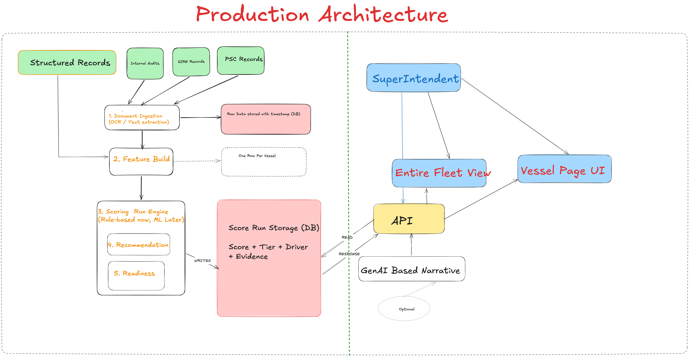

# Ship Detention Prevention & Early Warning System

A working prototype and production proposal for the question:

> **Using the information available before the next inspection, which vessels require intervention,
> why, and what should be done first?**

---

**[▶ 5-minute video walkthrough of my work]()**

---

## Live demo

### **[View the vessel card interface →](https://krishna-engineer.github.io/early-warning-system/demo.html)**

A static preview built to show how the solution would look in use — a ranked fleet, a vessel card,
and every piece of evidence clickable through to the source record it came from.

**It is an illustration, not a working deployment.** There is no server behind it and no live data.

---

## What the system produces

A **0–100 risk score and a High / Medium / Low tier for every vessel**, with the reasoning,
supporting records and recommended actions attached.

**Not a probability of detention.** There are 2 detentions in 80 inspections. Two events cannot
calibrate a percentage, and any number printed would be invented. The score is a *position in this
fleet today* — useful for deciding who to look at first, and not a statement about any vessel's
odds.

Seven dimensions, weighted by mechanism strength and the correlation evidence, then stress-tested:

| Dimension | Weight | What it detects |
|---|---|---|
| Repetition | 20 | the same fault recorded again — the fix never held |
| Trend | 20 | inspection outcomes deteriorating |
| Unresolved | 20 | findings left open, including ones the company already knew about |
| Maintenance | 15 | overdue planned jobs |
| Concentration | 15 | findings clustered in one area — a system, not bad luck |
| Crew | 5 | senior officer experience and turnover |
| Equipment | 5 | the same equipment failing repeatedly |

### Headline result

| Rank | Vessel | Score | Tier | Drivers |
|---|---|---|---|---|
| 1 | V001 | **85.5** | High | Repetition, Trend, Unresolved, Maintenance |
| 2 | V004 | **60.6** | High | Concentration, Trend, Unresolved, Repetition |
| 3 | V019 | 32.2 | Medium | Maintenance, Equipment, Repetition, Crew |
| 4+ | rest | ≤ 29.4 | Medium / Low | — |

Two vessels need intervention. **Beyond the top two or three this fleet is flat**, and the write-up
says so rather than implying rank 9 differs meaningfully from rank 12.

V001 and V004 are High for opposite reasons — one item broken nine times versus four different
navigation problems. Different mechanism, different department, different fix. That distinction is
why Repetition and Concentration are separate dimensions.

---

## Production architecture



**The design principle worth stating up front:** everything that produces a decision is
deterministic. The generative component only turns a finished decision into readable prose.

---

## Additional data that would materially improve this

| Data | Why it is needed |
|---|---|
| **Deficiency severity codes** | the single biggest gap — severity is what turns findings into detention, and the current model can only count |
| **Public PSC records (Paris / Tokyo MoU)** | real detention events at a volume that can calibrate a model, instead of two |
| **Vessel itinerary and next port** | inspection authority is a large multiplier on consequence, and there is currently no way to know who inspects next |


## Running it

```bash
git clone https://github.com/krishna-engineer/early-warning-system.git
cd early-warning-system
uv sync --all-groups
uv run jupyter notebook
```